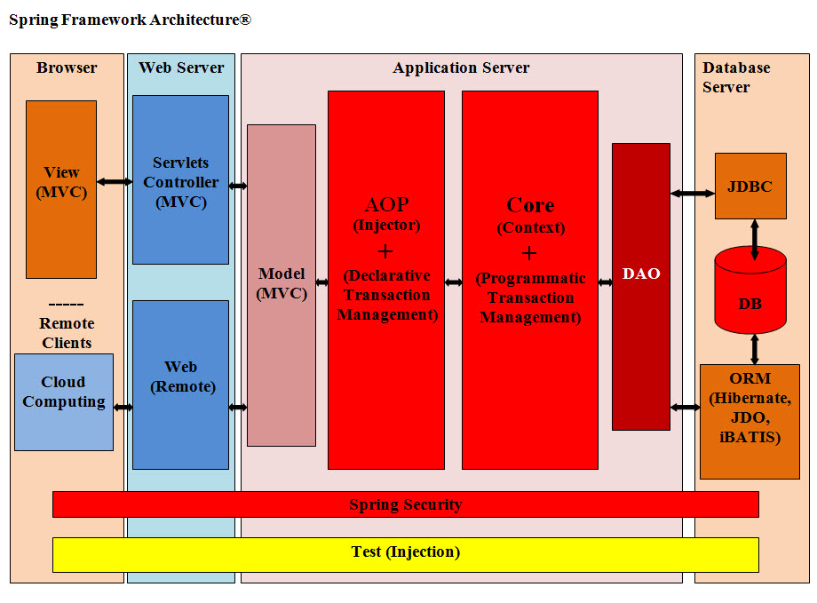
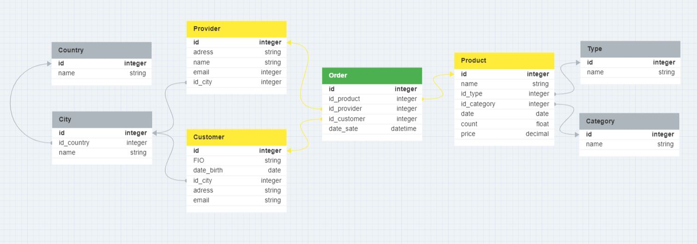

# Урок 7. Типа архитектур WEB-приложений: MPA, SPA.
## Classwork

Spring_MVC:

DJANGO_ARCH:

## Homework
1. Доработать экранные формы интерфейса в https://www.figma.com/ или https://app.diagrams.net/.

2. Разработать полную ERD домена в https://www.dbdesigner.net/.

3. Разработать диаграмму компонент в UML включая слои пользовательского интерфейса и бизнес-логики.

